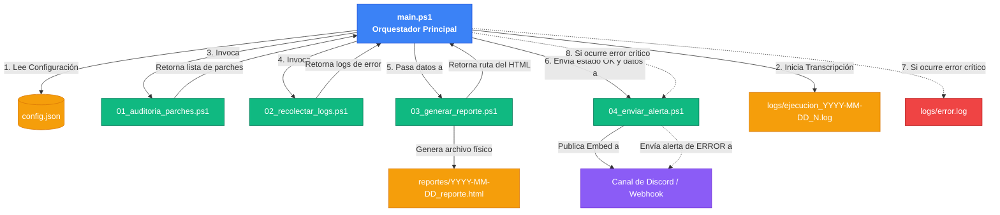

# Gestión de Parches y Auditoría de Seguridad Automatizada en Windows (DevSecOps)

Este repositorio contiene un sistema de automatización completamente autónomo para la auditoría de seguridad y salud de servidores Windows 10/11 y Windows Server.

El proyecto realiza de forma periódica la detección de parches de seguridad críticos pendientes, recopila eventos de error recientes del sistema, genera reportes visuales en formato HTML y notifica mediante webhook a canales de comunicación como Discord.

---

## Requisitos Previos

- **Sistema Operativo:** Windows 10, Windows 11 o Windows Server 2016+.
- **PowerShell:** Versión 5.1 o superior.
- **Permisos:** Consola de PowerShell ejecutada con privilegios de **Administrador**.
- **Acceso a Internet:** Necesario para descargar el módulo `PSWindowsUpdate` (si no está instalado) y para enviar las notificaciones webhook.

---

## Instalación en un Solo Comando

Para instalar, configurar las carpetas, instalar dependencias y programar el sistema de auditoría diaria, ejecuta el instalador desde una consola de PowerShell con privilegios de **Administrador**:

```powershell
.\setup.ps1
```

> [!WARNING]
> **Importación Manual del XML (`tasks/AuditoriaWindows.xml`):**
> El archivo XML está configurado por defecto con una ruta de plantilla genérica (`C:\Ruta\De\Instalacion\scripts\main.ps1`) y configurado para ejecutarse bajo la cuenta del sistema local (`SYSTEM` / `S-1-5-18`).
> 
> * **Si importas el XML manualmente** en tu Programador de Tareas, deberás editar previamente el archivo para reemplazar `C:\Ruta\De\Instalacion\scripts\main.ps1` por la ruta absoluta real donde descargaste el proyecto en tu máquina.
> * **Solución Recomendada:** Ejecuta siempre el instalador `.\setup.ps1` desde PowerShell como Administrador. Este script registra la tarea dinámicamente con tu ruta local real y genera/sobreescribe el XML sanitizándolo de forma automática antes de guardarlo.

### ¿Qué hace el instalador (`setup.ps1`)?

1. Verifica que el script se ejecute como Administrador.
2. Habilita TLS 1.2 y configura NuGet como repositorio de confianza.
3. Instala el módulo de PowerShell `PSWindowsUpdate` si no se encuentra en el sistema.
4. Establece la directiva de ejecución local como `RemoteSigned`.
5. Crea la estructura completa de carpetas del proyecto.
6. Genera el archivo `config/config.json` dinámicamente mapeando las rutas absolutas locales.
7. Registra y exporta una **Tarea Programada** nativa de Windows que ejecutará la auditoría todos los días a las **08:00 AM** con máximos privilegios, incluso si no hay una sesión de usuario activa.

---

## Configuración del Webhook de Notificaciones

Por seguridad, los datos sensibles no se suben a Git. La configuración del Webhook se realiza de forma local en el archivo `config/config.json`:

```json
{
  "webhookUrl": "https://discord.com/api/webhooks/TU_WEBHOOK_AQUI",
  "umbralParchesCriticos": 5,
  "horasAtras": 24,
  "rutaReportes": "C:\\Ruta\\De\\Instalacion\\reportes",
  "rutaLogs": "C:\\Ruta\\De\\Instalacion\\logs"
}
```

Reemplaza `"https://discord.com/api/webhooks/TU_WEBHOOK_AQUI"` por tu webhook de canal real de Discord o Slack para recibir las alertas en tiempo real.

---

## Estructura del Proyecto

```
├── scripts/
│   ├── main.ps1                    # Orquestador principal (ejecuta módulos y maneja excepciones globales)
│   ├── 01_auditoria_parches.ps1    # Módulo de auditoría (PSWindowsUpdate)
│   ├── 02_recolectar_logs.ps1      # Módulo de lectura de Event Viewer (System y Security)
│   ├── 03_generar_reporte.ps1      # Módulo generador de reporte HTML (CSS inline, semáforo visual)
│   └── 04_enviar_alerta.ps1        # Módulo de alerta Webhook (reintento exponencial backoff 3x)
├── config/
│   ├── config.json.template        # Plantilla limpia de configuración para control de versiones
│   └── config.json                 # Configuración real del servidor (ignorado por git)
├── reportes/                       # Salida: reportes HTML fechados (ignorado por git)
├── logs/                           # Salida: logs de ejecución y logs de error (ignorado por git)
├── tasks/
│   └── AuditoriaWindows.xml        # Exportación XML de la Tarea Programada de Windows
├── setup.ps1                       # Instalador automático centralizado
└── README.md                       # Documentación del sistema
```

### Flujo de Ejecución y Orquestación

El orquestador principal (`main.ps1`) administra de forma secuencial y estructurada la recolección, generación de reportes y envío de alertas. A continuación se detalla gráficamente el flujo:



---

## Interfaz Gráfica de Usuario (GUI)

Hemos incorporado una consola de administración visual basada en web local para facilitar la ejecución y configuración del sistema.

Para iniciar la interfaz gráfica:

1. Abre una consola de PowerShell y ejecuta:
   ```powershell
   .\run_gui.ps1
   ```
2. Esto iniciará un micro-servidor web en `http://localhost:8080` y abrirá automáticamente tu navegador web predeterminado.
3. Desde el panel visual podrás:
   - **Ejecutar Auditorías:** Haces clic en un botón y observas el resultado de PowerShell en una terminal web en tiempo real.
   - **Reconfigurar el Servidor:** Modificas el Webhook de Discord y los umbrales de alerta a través de un formulario sin editar el JSON manualmente.
   - **Explorar Reportes:** Listas todos los archivos HTML históricos generados y los abres con un solo clic en una pestaña nueva.

---

## Ejecución Manual y Pruebas

Si deseas auditar el servidor manualmente por consola en cualquier momento, ejecuta:

```powershell
.\scripts\main.ps1
```

### Escenarios de Prueba Evaluados

1. **Ejecución normal:** Generará un archivo `reportes/YYYY-MM-DD_reporte.html` y enviará un mensaje Embed de color **Verde** a Discord informando sobre el estado de parches y errores.
2. **Escenario de vulnerabilidad:** Si el número de parches pendientes supera el umbral configurado (`umbralParchesCriticos`), el reporte HTML y el webhook se tornarán de color **Rojo** alertando al equipo.
3. **Escenario de fallo de red:** Si no hay conexión a internet para conectar con el Webhook, el script reintentará 3 veces de manera exponencial (esperando 2, 4 y 8 segundos) y escribirá el reporte de error y traza de excepción en `logs/error.log`.
4. **Escenario de excepción interna:** Si ocurre un error de hardware o configuración (ejemplo: falta de disco o módulo inaccesible), el orquestador lo detectará, enviará una alerta de error en Discord (si hay red) y se registrará en `logs/error.log` con código de salida `1` para el Programador de Tareas.

---

## Solución de Problemas (Troubleshooting)

### 1. Error en la Auditoría de Parches (Servicio `wuauserv` detenido o deshabilitado)
* **Síntoma:** El reporte, la terminal de la GUI o el archivo de log muestra errores al buscar actualizaciones, y reporta que el servicio `wuauserv` (Windows Update) no está activo o está deshabilitado.
* **Causa:** El servicio de actualizaciones de Windows fue deshabilitado por directivas de grupo locales/dominio o por utilidades de optimización del sistema.
* **Solución:**
  1. Abre una consola de PowerShell con privilegios de **Administrador**.
  2. Ejecuta los siguientes comandos para configurar el inicio del servicio en automático y levantarlo:
     ```powershell
     Set-Service -Name wuauserv -StartupType Automatic
     Start-Service -Name wuauserv
     ```
  3. Ejecuta `Get-Service -Name wuauserv` para verificar que el estado sea `Running`.
  4. Si tu máquina pertenece a un dominio con WSUS/GPO restrictivas, solicita al administrador del sistema habilitar el servicio Windows Update en la directiva.

### 2. Error al Instalar o Cargar el Módulo `PSWindowsUpdate`
* **Síntoma:** El script finaliza indicando que no puede importar `PSWindowsUpdate`.
* **Causa:** La política de ejecución no permite módulos de terceros o la descarga desde la PowerShell Gallery está bloqueada.
* **Solución:**
  1. Asegúrate de ejecutar la consola como Administrador.
  2. Fuerza la instalación del proveedor y del módulo ejecutando:
     ```powershell
     Set-ExecutionPolicy RemoteSigned -Force
     [Net.ServicePointManager]::SecurityProtocol = [Net.SecurityProtocolType]::Tls12
     Install-PackageProvider -Name NuGet -Force
     Install-Module -Name PSWindowsUpdate -Force -SkipPublisherCheck
     ```

### 3. Las Alertas por Webhook no llegan a Discord
* **Síntoma:** La ejecución finaliza con éxito localmente, pero no se recibe ninguna alerta en los canales de comunicación.
* **Causa:** URL de webhook incorrecta o falta de conectividad HTTP saliente hacia la API externa.
* **Solución:**
  1. Abre `config/config.json` (o usa la GUI) y valida que la propiedad `webhookUrl` tenga el enlace correcto sin comillas duplicadas ni caracteres corruptos.
  2. Realiza una prueba rápida enviando un mensaje directo mediante PowerShell:
     ```powershell
     Invoke-RestMethod -Uri "TU_WEBHOOK_DE_DISCORD_AQUI" -Method Post -Body '{"content":"Prueba de conexion desde el servidor"}' -ContentType 'application/json'
     ```
  3. Si recibes un error de red o timeout, comprueba la configuración de tus Firewalls, proxies corporativos u otras restricciones de red saliente.
